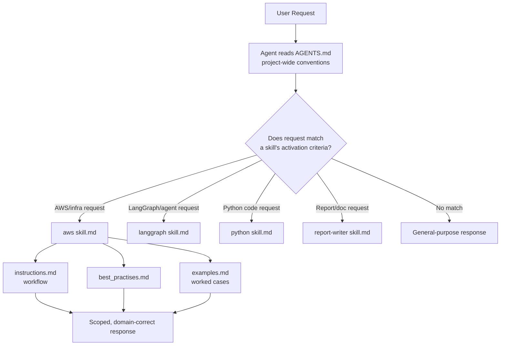

# Agent Skills Framework

A structured system for giving AI coding agents (Claude, or any agent framework that reads markdown context files) **reliable, domain-specific expertise** instead of relying on general-purpose knowledge alone. Each skill is a self-contained module the agent can activate on demand, paired with a project-wide behavior specification that governs how the agent should code, test, and communicate regardless of which skill is active.

## Why this project

General-purpose LLM agents are inconsistent when asked to do specialized work — they'll sometimes recommend a deprecated AWS service, skip IAM configuration, or write code that doesn't match a project's conventions. This framework solves that by giving the agent **explicit, activatable skill definitions**: when a domain-specific request comes in, the agent has a scoped playbook — purpose, boundaries, best practices, and real worked examples — instead of improvising from general training.

## Structure

### `AGENTS.md` — Agent Behavior Specification
The project-wide operating manual the agent follows regardless of which skill is active:
- Coding standards (PEP 8, type hints, function length limits)
- File organization conventions (`app/api/`, `app/services/`, `app/utils/`, `app/db/`)
- Security rules (no hardcoded secrets, environment variables only)
- Testing, dependency, and documentation policy
- A pre-completion checklist the agent runs before considering a task done

### Skill Modules
Each skill follows a consistent four-file pattern:

| File | Role |
|---|---|
| `skill.md` | Purpose, scope, and activation criteria — when should this skill turn on? |
| `instructions.md` | Step-by-step operating workflow for the domain |
| `best_practises.md` | Domain-specific do's and don'ts |
| `examples.md` | Worked request → recommended-output pairs |

**AWS Cloud Engineering** (fully implemented) — activates on any AWS, infrastructure, deployment, or DevOps request. Covers IAM, compute (EC2/Lambda/ECS/Fargate), storage, databases, networking, monitoring, CI/CD, and cost optimization, all framed around the AWS Well-Architected Framework. Includes 10 worked architecture examples, from a simple FastAPI deployment to a full multi-region, production AI application stack (FastAPI → LangGraph → Bedrock → Aurora → CloudWatch → Secrets Manager).

**LangGraph Agent Development** — covers building and operating LangGraph-based agents, including pluggable state backends. A companion notebook demonstrates a deep agent built with the `deepagents` library, comparing an in-memory `StateBackend` (state lives only in the LangGraph run) against a `FilesystemBackend` (state is mirrored to disk), plus tool integration (Tavily web search) and a Groq-hosted LLM.

**Python** and **Report Writing** — additional skill modules following the same four-file structure, extending the same activation-based pattern to general Python development conventions and structured report/document generation.

## How it works



## Tech Stack

| Layer | Technology |
|---|---|
| Agent context format | Markdown-based skill files (`skill.md`, `instructions.md`, `best_practises.md`, `examples.md`) |
| Demonstrated skill runtime | LangGraph, `deepagents` (`StateBackend`, `FilesystemBackend`) |
| LLM | Groq (`llama-3.3-70b-versatile`) |
| Tooling | Tavily web search (via LangChain tool integration) |
| Target agent frameworks | Claude / any agent capable of reading structured markdown context |

## Getting Started

### Using the skills with an agent
Point your agent framework's context/system files at the `AGENTS.md` file and the relevant `skills/<domain>/` folder. Most agent frameworks (including Claude) support loading these as reference context automatically, or you can inline them into a system prompt.

### Running the LangGraph example

```bash
pip install langchain-groq langchain-tavily deepagents python-dotenv
```

```
GROQ_API_KEY=your_key_here
TAVILY_API_KEY=your_key_here
```

```python
from deepagents import create_deep_agent
from deepagents.backends import StateBackend, FilesystemBackend
```

Run the accompanying notebook to see both backend modes — in-memory virtual filesystem vs. real disk-backed state — demonstrated side by side.

## Project Structure

```
.
├── AGENTS.md                    # Project-wide agent behavior spec
├── skills/
│   ├── aws/
│   │   ├── skill.md
│   │   ├── instructions.md
│   │   ├── best_practises.md
│   │   └── examples.md
│   ├── langgraph/
│   │   └── backends.ipynb        # Deep agent + pluggable backend demo
│   ├── python/
│   └── report-writer/
```

## Design Notes

- **Activation, not always-on.** Every skill defines explicit activation criteria so the agent only loads domain-specific behavior when it's actually relevant — avoiding context bloat on unrelated requests.
- **Examples over rules alone.** Each skill pairs abstract best practices with concrete worked examples (request → recommended architecture/output), since agents follow patterns more reliably than prose guidelines alone.
- **Behavior and knowledge are separated.** `AGENTS.md` governs *how* the agent works (code style, file layout, safety rules); skill files govern *what* it knows. This keeps project conventions stable even as skills are added or updated.

## License

Add a license of your choice (e.g., MIT).
